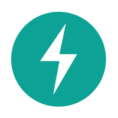

[简体中文](./README.en.md) | English

<div align="center">
<h1> WAYCLOUD-DESIGN </h1>

<p>Never extinguish the fire in your heart, even if others only see smoke.</p>
</div>

[](https://github.com/Wayne1308/waycloud-design)
[](https://gitee.com/Wayne1308/weiManage)
[](https://en.wikipedia.org/wiki/MulanPSL-2.0)
[](https://github.com/vuejs/vue)

---

## 🍊 Project introduction

- WAYCLOUD-DESIGN is a front-end development system including optional common front-end rapid development templates and general system of components
- Technology stack: vue3+vite+TypeScript+axios+ElementuiPlus
- Two modes are optional: self built framework development, optional configuration drag and drop development
- Good type definition
- Back end route dynamic rendering

## 🌐 Branch Description

- dev - Main branch of development iteration version
- dev-base - Basic development version

## 🍻 Is there a problem & Learn with me!

- If you think it's good, click start!
- WeChat: CW_ GOGOGO_ XD (note: design)


## 🌱 Project development start

```bash
# Clone Project
git clone https://github.com/Wayne1308/waycloud-design.git

# Toggle Branch
git checkout dev # Main branch of development iteration version
git checkout dev-base # Basic development version

# Installation Dependencies
npm install
# or
yarn install

# Local Development Initiatives
npm run dev
# or
yarn run dev
```

## 🎨 Thank you all!

| Project                                                       |
| ------------------------------------------------------------- |
| [vue](https://github.com/vuejs/vue)                              |
| [element-ui](https://github.com/ElemeFE/element)                 |
| [element-plus](https://github.com/element-plus/element-plus)     |
| [mock](https://github.com/nuysoft/Mock)                          |
| [axios](https://github.com/axios/axios)                          |

## 💚 Suitable for people

- You are developing and want to use element ui/element plus, with 1 year of front-end development experience.
- Get familiar with Vue Js technology stack, which has been used to develop several actual projects.
- Students who are interested in principle technology and want to upgrade.
